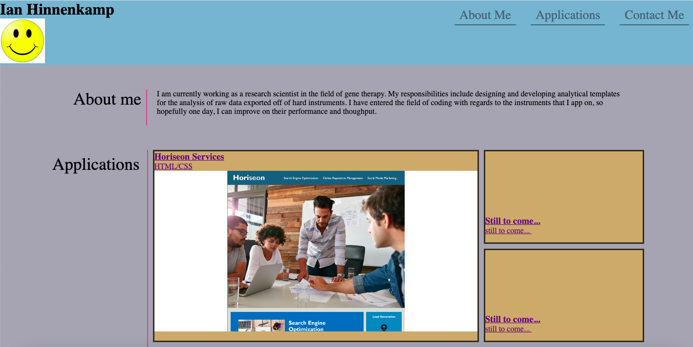
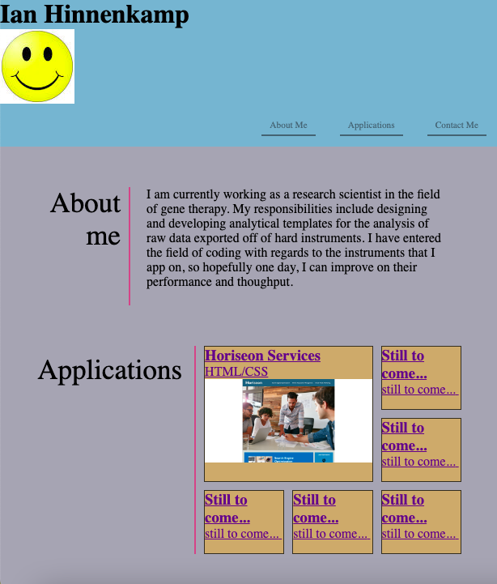
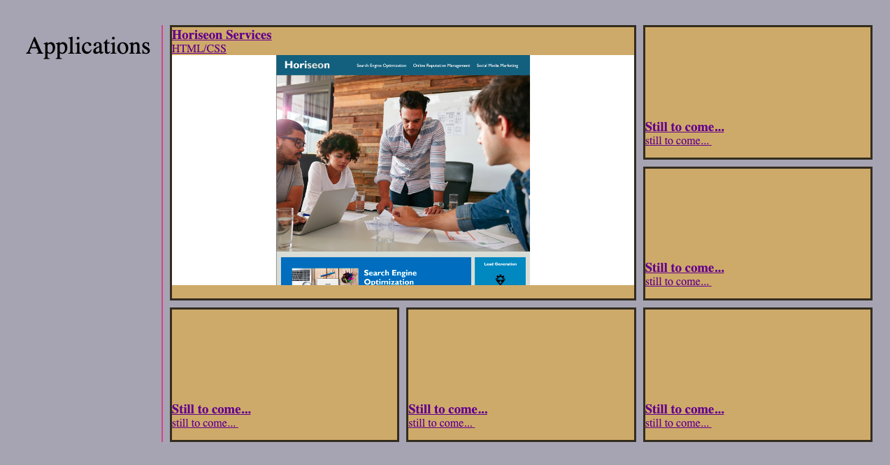

# professional-portfolio
This repository focuses on storing, updating, and displaying Ian Hinnenkamp's professional portfolio

1. [ Description. ](#desc)
2. [ Web Address. ](#web-address)
3. [ Usage tips. ](#usage)

<a name="desc"></a>
## 1. Description

### This is the official site for Ian Hinnenkamp's professional portfolio.

Desktop screen:



Smaller devices screen example:



<a name="web-address"></a>
## 2. How to Get There

### Open your preferred web browser and enter the following web address to access.

```html
https://hinnenk2.github.io/professional-portfolio/
```
<a name="usage"></a>
## 3. Usage Tips

### Use the top right navigation panel to visit the different applications presented on the web page.

Desktop screen:


Application Selection:

